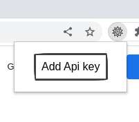

# How to use

## Functionality
### Query selection text and free-form input 

https://user-images.githubusercontent.com/69144096/191131329-9a96091a-0837-4872-bb03-b29557e43bd4.mp4

### Seamless work with google,...

https://user-images.githubusercontent.com/69144096/191131367-e3ff00ce-d75d-4965-a1c0-3336a718f765.mp4

## Insert
- Download the zip at release section or clone the repo.
- Unzip if you download the zip.
- Open chrome://extensions/ (or edge://extensions ) in your  browser.
- Turn on developer mode
- 
- Unpack the directory of unziped file (or cloned repo) 
- 

## Obtain api keys 
- Create Wolfram account if you don't have one at [this link](https://account.wolfram.com/login/create)
- IF you have once, login and go to [this link](https://developer.wolframalpha.com/portal/myapps/), create app api key.
- Add the api key by go to option page 

- I inject my temporary key here due to this extension still beta, so you can use the directly, but api call limit each month is just 2000, so if you want to use it more, you need to create your own key.

## TODO

- [ ] Integrated with duckduckgo
- [ ] Integrated with bing
- [ ] Integrated with wikipedia
- [ ] Integrated with wikidata
